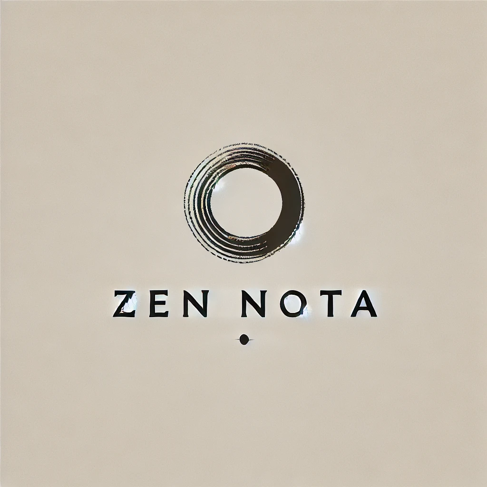

### Nota: Focus on essential.
> - Less clutter, more clarity.
> - AI Assistant Job Flow Automator. 
> - The minimalist note-taking app that lets you focus on what's important.

<a href='https://www.hypech.com'>
</img></a>
  

 
[?style=for-the-badge>)](https://hypech.com)

 

- **Nota:** Notes that keep it simple.  
- **Nota:** Capture thoughts, effortlessly.  
- **Nota:** The minimalist way to take notes.  
- **Nota** - Uncluttered note-taking for clear thinking.  
- **Nota** - Write down what matters, simply.  
- **Nota** - The lightweight way to capture daily ideas.  
- **Nota:** Keep track of what matters, every day.  
- **Nota:** Your daily record, always at hand.  
- **Nota:** Never forget a thing.  
- **Nota** - Build a record of your daily tasks and ideas.  
- **Nota** - Your daily journal, made simple.  
- **Nota** - Archive your notes for future reference, effortlessly.  
- **Nota:** Simply capture and remember what matters.  
- **Nota:** Minimalist notes for your daily record.  
- **Nota:** Write, remember, forget nothing.  
- **Nota** - Easily jot down daily notes and keep a record.  
- **Nota** - The minimalist note-taking app for daily tasks and journaling.  
- **Nota** - Capture quick notes and build a simple record of your day.  
- **Nota:** Less clutter, more clarity.  
- **Nota:** Focus on what's essential.  
- **Nota:** Write. Remember. Done.  
- **Nota** - The minimalist note-taking app that lets you focus on what's important.  
- **Nota** - Declutter your mind, one note at a time.  
- **Nota** - Simple, powerful note-taking for a productive day.  

Declutter your mind, start minimalist note. Capture thoughts, effortlessly.
Always in your heart, never out of mind — capture moments, cherish forever.
Tiny, clean, and quiet — Zen Nota is always there, yet never in the way.

Zen Nota – Find Clarity in Simplicity

Tired of cluttered note-taking apps? Zen Nota brings a fresh, minimalist approach to help you focus on what truly matters.

✨ Embrace the Power of Simplicity

✅ Three-Line Limit – Distill your thoughts to their essence. Keep it short, clear, and impactful.
✅ Minimalist Design – A clean, distraction-free interface that promotes focus and tranquility.
✅ Local Storage – Your notes are stored securely on your device for privacy and offline access.
✅ Essential Features Only – No unnecessary extras. Just write, list, and delete—simple and efficient.

🧘 Declutter Your Mind, One Note at a Time

• Jot down quick reminders, fleeting ideas, or daily intentions.
• Simplify your to-do list by focusing on what’s truly important.
• Find a moment of calm by capturing thoughts and clearing mental clutter.

💡 Why Choose Zen Nota?

🔹 Focus – Eliminate distractions and concentrate on the essentials.
🔹 Simplicity – A truly minimalist app designed for clarity.
🔹 Privacy – No cloud syncing. Your notes stay on your device.
🔹 Efficiency – Capture your thoughts effortlessly.

🎯 Who is Zen Nota for?

✔️ Individuals who want a simple and effective note-taking solution.
✔️ Minimalists seeking a clutter-free digital experience.
✔️ Anyone looking to improve focus and reduce distractions.

📲 Download Zen Nota today and experience the peace of mind that comes with simplicity!

✨ Embrace the Power of Simplicity

Zen Nota is designed to be so light, so quiet, so seamless—you won’t even notice it’s there. No clutter, no distractions, no unnecessary features. Just a clean, effortless space to capture what matters the moment it crosses your mind.

🧘 Inspired by the spirit of "Always in my heart, never out of mind," Zen Nota stays in the background, never getting in your way, but always ready when you need it. Whether it’s a fleeting thought, a sudden inspiration, or a moment you don’t want to forget, Zen Nota is just one tap away—no loading delays, no complex menus, just pure, instant note-taking.

💡 Why Zen Nota?

🔹 Lightweight & Fast – Opens instantly, so you never miss a thought.
🔹 Minimal & Clean – No clutter, no distractions—just you and your notes.
🔹 Quiet & Invisible – Stays out of the way until you need it, like a silent companion.
🔹 Effortlessly Simple – No sign-ups, no extra steps—just tap, type, and save.

🕰️ Zen Nota is more than an app; it’s a quiet space that exists only when you need it. 

🔹 No more searching for a note-taking app lost among dozens of others. 
🔹 No more distractions when all you need is a blank page. 
🔹 Just one click, one thought, one moment—captured effortlessly.

🎯🎯🎯 Zen Nota – Always in my heart, never out of mind. 🌿🌿🌿

📲 Download Zen Nota today and experience the peace of mind that comes with simplicity!
