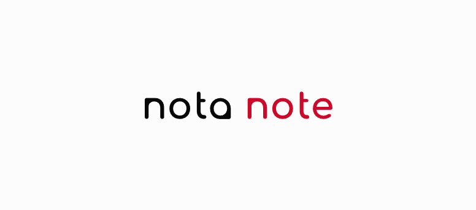

### Nota: Focus on essential.
> - Less clutter, more clarity.
> - AI Assistant Job Flow Automator. 
> - The minimalist note-taking app that lets you focus on what's important.

<a href='https://www.hypech.com'>
</img></a>
  

 
[?style=for-the-badge>)](https://hypech.com)

 

Nota: Notes that keep it simple.
Nota: Capture thoughts, effortlessly.
Nota: The minimalist way to take notes.
Nota - Uncluttered note-taking for clear thinking.
Nota - Write down what matters, simply.
Nota - The lightweight way to capture daily ideas.
Nota: Keep track of what matters, every day.
Nota: Your daily record, always at hand.
Nota: Never forget a thing.
Nota - Build a record of your daily tasks and ideas.
Nota - Your daily journal, made simple.
Nota - Archive your notes for future reference, effortlessly.
Nota: Simply capture and remember what matters.
Nota: Minimalist notes for your daily record.
Nota: Write, remember, forget nothing.
Nota - Easily jot down daily notes and keep a record.
Nota - The minimalist note-taking app for daily tasks and journaling.
Nota - Capture quick notes and build a simple record of your day.
Nota: Less clutter, more clarity.
Nota: Focus on what's essential.
Nota: Write. Remember. Done.
Nota - The minimalist note-taking app that lets you focus on what's important.
Nota - Declutter your mind, one note at a time.
Nota - Simple, powerful note-taking for a productive day.

 
